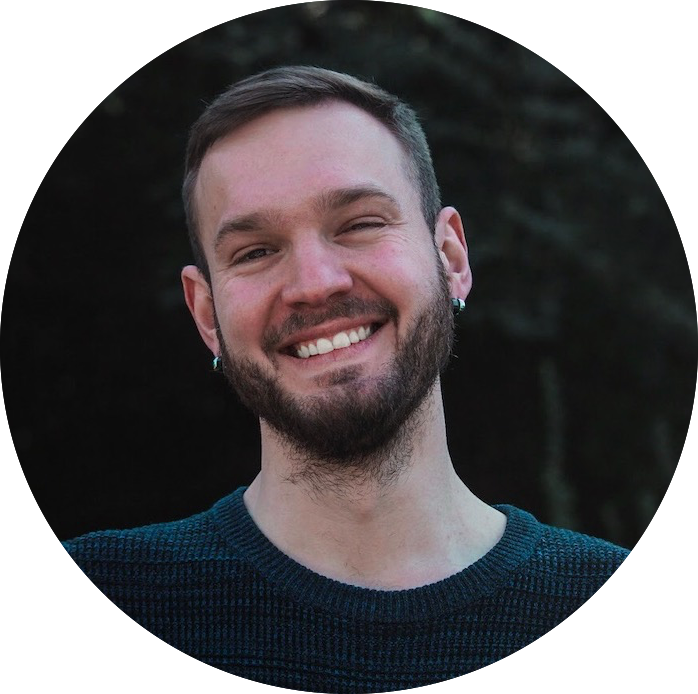

```{r setup, include=FALSE, purl=FALSE}
knitr::opts_chunk$set(
    echo = FALSE,
    cache = TRUE,
    tidy = "styler",
    tidy.opts = list(scope = "indention"),
    fig.align = 'center',
    out.width = '100%'
)
```

:::: {style="display: flex;"}

::: {.column width="65%"}

This website mainly serves a two-fold purpose:

1. It acts as a convenient interface with many of my Github projects and groups them in a more palatable manner than is possible using Github alone.
2. Due to this bundling, I use it as a comprehensive CV for my work in (experimental) linguistics that links to the various items; see the `Research` and `Teaching` tabs. All of my work is centered around phenomena in semantics, pragmatics, or their interface.

All content was generated using [R-Markdown](https://rmarkdown.rstudio.com).

I use [*he/him*](http://pronoun.is/he) pronouns.

:::

::: {.column width="15%"}
\ 
<!-- an empty Div (with a white space), serving as
a column separator -->
:::

::: {.column width="20%"}

:::

::::
