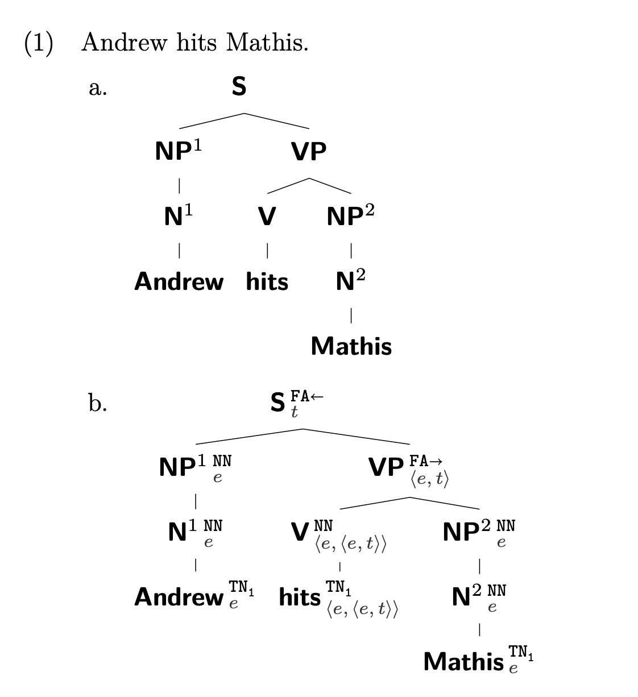
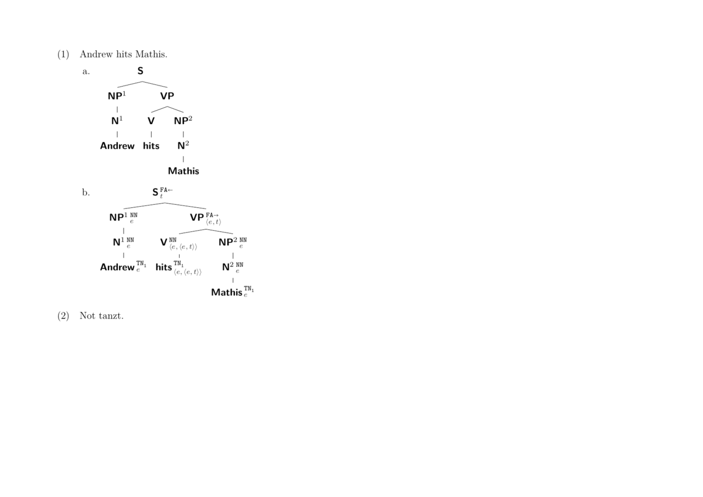

```
The following description is taken directly from the README of the associated Github page. 
```

This script is a very simple program that parses LaTeX [TikZ qtree](https://ctan.org/pkg/tikz-qtree?lang=en)<sup id="a1">[1](#f1)</sup> strings and outputs the same tree annotated with semantic types and the rules of composition (Heim-&-Kratzer-style) that led to that type. Being simple, the script comes with a number of restrictions some of which I'll detail below. 

As an aside, my implementation is the offspring of a desire to program, rather than one to innovate. There are certainly better and more thought-out alternatives around.

<b id="f1">1</b> For TikZ itself, see https://www.ctan.org/pkg/pgf. [↩](#a1)

## Getting Started

```python
# lexicon that includes the semantic types
lex = {"e": ["Andrew", "Mathis"], "<e, t>": ["hits"]}

# define the tree that is to be annotated
tree_string = "[.\\node(top){S }; [.NP^1 [.N^1 Andrew ] ] [.VP [.V hits ] [.NP^2 [.N^2 Mathis ] ] ] ]"

# save the output to a LaTeX file
with open("LaTeX/treeparses.tex", "w") as f:
    f.write(tree_to_latex(tree_string, lex))
```

## Examples

### Single Image

The input string in (1) produces the output below (once the corresponding (Xe)LaTeX code is compiled to pdf).

1. `[.\\node(top){S }; [.NP^1 [.N^1 Andrew ] ] [.VP [.V hits ] [.NP^2 [.N^2 Mathis ] ] ] ]`

<p align="center">

</p>

### Multipage PDF

<p align="center">

</p>
