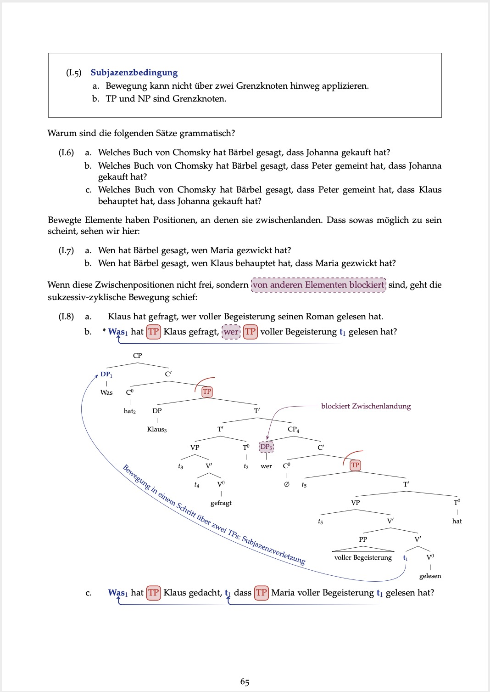

### Available Online

:::: {style="display: flex;"}

::: {}

Introduction to Statistics With R: 

<a href="https://mkthalmann.github.io/inferenz/">

</a>

:::

::: {.column width="15%"}
\ 
<!-- an empty Div (with a white space), serving as
a column separator -->
:::

::: {}

Linguistic Semantics:

<a href="https://github.com/mkthalmann/TutorialNotes_HK/blob/master/recap.pdf">

</a>

:::

::: {.column width="15%"}
\ 
<!-- an empty Div (with a white space), serving as
a column separator -->
:::

::::

  

### Available Upon Request

:::: {style="display: flex;"}

::: {}

Generative Syntax:

:::

::: {.column width="15%"}
\ 
<!-- an empty Div (with a white space), serving as
a column separator -->
:::

::: {}

Experiment Design and Stats: 

:::

::::
