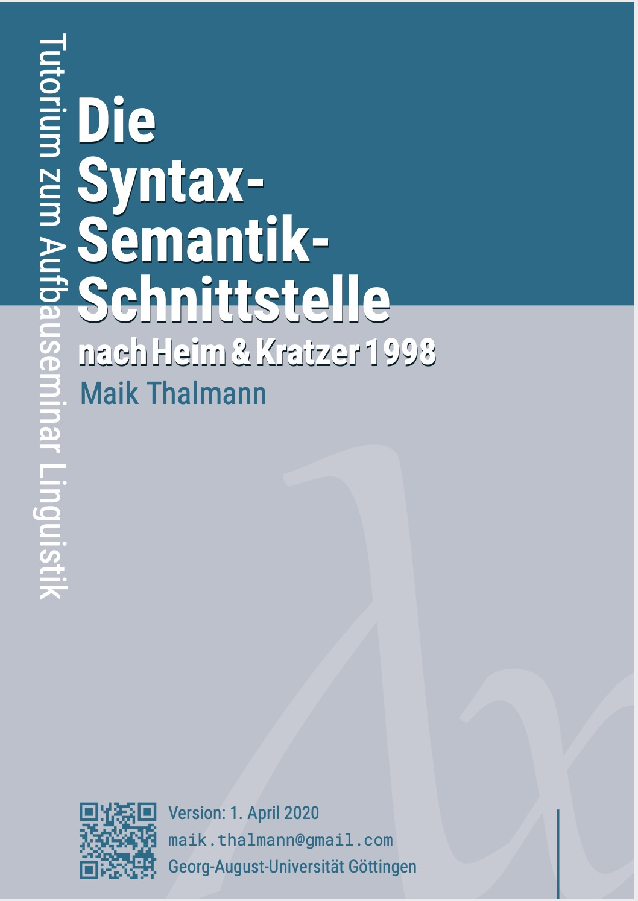

## Available Online

:::: {style="display: flex;"}

::: {}

Introduction to Statistics With R: 

<a href="https://mkthalmann.github.io/inferenz/">

</a>

:::

::: {.column width="15%"}
\ 
<!-- an empty Div (with a white space), serving as
a column separator -->
:::

::: {}

Linguistic Semantics:

<a href="https://github.com/mkthalmann/home/tree/master/media/teaching/AS_semantik.pdf">

</a>

:::

::: {.column width="15%"}
\ 
<!-- an empty Div (with a white space), serving as
a column separator -->
:::

::::

  

## Available Upon Request

:::: {style="display: flex;"}

::: {}

Generative Syntax:

:::

::: {.column width="15%"}
\ 
<!-- an empty Div (with a white space), serving as
a column separator -->
:::

::: {}

Experiment Design and Stats: 

:::

::::

## All Classes Taught

Below is a list of the classes I have taught over the years (all in Göttingen, Germany), sorted from newest to oldest.

1. Lab Class: Inferential Statistics (Using R); 2019--2020 (1 term)
1. Graduate Level Course: Grammaticalization (with Katharina Paul and [Markus Steinbach](https://www.uni-goettingen.de/en/122398.html)); 2018-2020 (1 term)
1. Lab Class: Descriptive Statistics (Using R); 2018--2019 (2 terms)
1. Graduate Level Course:  Speech Acts (with Katharina Paul and [Markus Steinbach](https://www.uni-goettingen.de/en/122398.html)); 2017/2018 (1 term)
1. Lab Class: Syntax-Semantics-Interface (alternating between semantics and syntax every term); 2017--2019 (5 terms)
1. Lab Class: Introduction to Linguistics 1 and 2; 2015--2018 (6 terms)
